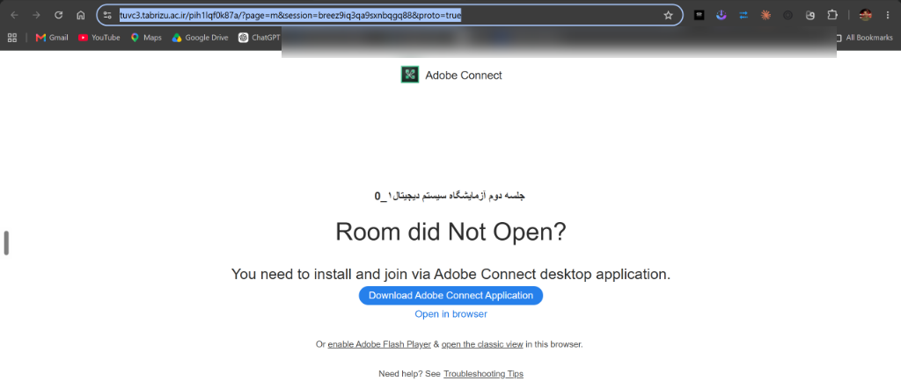

# AC-Downloader Pro 🎓

دانلودر اختصاصی، آفلاین و هوشمند کلاس‌های **Adobe Connect**، طراحی‌شده به‌طور ویژه برای **سامانه tulms دانشگاه تبریز**.

این ابزار نیازی به ضبط صفحه نمایش (Screen Recording) یا مرورگرهای سنگین ندارد؛ بلکه با دریافت مستقیم فایل‌های خام و پردازش فایل‌های XML، **صدا، تصویر استاد و تک‌تک اسلایدهای PDF را با دقت میلی‌ثانیه (Frame-Exact) همگام‌سازی کرده** و یک فایل ویدیویی MP4 یا صوتی MP3 بی‌نقص به شما تحویل می‌دهد.

---

## 🌟 ویژگی‌های کلیدی (چرا AC-Downloader Pro؟)

- **بازسازی فریم‌به‌فریم (XML-based):** استخراج دقیق رویدادهای ورق زدن اسلایدها و همگام‌سازی آن‌ها با صدای استاد بدون افت کیفیت.
- **کاملاً مستقل (Standalone):** بدون نیاز به نصب Google Chrome، FFmpeg یا هیچ پیش‌نیاز دیگری. فقط نصب کنید و اجرا کنید!
- **عبور از محدودیت‌های شبکه:** بهینه‌سازی شده برای دور زدن خطاهای 403 و مدیریت ریدایرکت‌های سامانه دانشگاه.
- **رابط کاربری مدرن:** دارای یک محیط گرافیکی خلوت، مینیمال و تاریک با تجربه کاربری عالی.
- **پردازش کاملاً آفلاین:** پس از اتمام دانلود اولیه، تمام پردازش‌های ویدیویی به صورت آفلاین روی پردازنده سیستم شما انجام می‌شود (امنیت بالا و عدم نیاز به سرور واسط).

---

## 🚀 راهنمای استفاده (آموزش گام‌به‌گام)

برای استخراج کلاس‌ها، لطفاً مراحل زیر را به دقت دنبال کنید:

### گام اول: دریافت لینک صحیح کلاس
1. وارد سامانه مدیریت یادگیری دانشگاه تبریز (	ulms.tabrizu.ac.ir) شوید.
2. روی لینک جلسه ضبط شده کلاس کلیک کنید.
3. معمولاً به صفحه‌ای از ادوبی کانکت هدایت می‌شوید که در آن پیغام Room did Not Open? نوشته شده است.
4. **مهم‌ترین بخش:** دقیقاً در همین صفحه، **آدرس کامل را از نوار بالای مرورگر (Address Bar) کپی کنید**.

> ⚠️ **لینک شما باید دقیقاً مشابه ساختار زیر باشد و حتماً شامل عبارت session= باشد:**
> https://tuvc3.tabrizu.ac.ir/class_name/?page=m&session=breez_xxxxxxxxxxxxxxxx&proto=true

*(لطفاً کل لینک را کپی کنید)*

### گام دوم: استخراج در برنامه
1. برنامه **AC-Downloader Pro** را اجرا کنید.
2. لینک کپی شده را در فیلد **«لینک جلسه» (RECORDING URL)** قرار دهید (Ctrl+V).
3. در صورت نیاز، فرمت خروجی (ویدیوی MP4 یا فقط صدای MP3) را انتخاب کنید.
4. روی دکمه **«شروع استخراج»** کلیک کنید.
5. منتظر بمانید تا دانلود و پردازش تمام شود. خروجی نهایی در بخش **«بایگانی»** برنامه در دسترس شما خواهد بود و می‌توانید پوشه آن را باز کنید.

---

## 📦 نصب و راه‌اندازی

به هیچ دانش فنی نیاز ندارید. کافیست از بخش [Releases](../../releases) مخزن، آخرین نسخه فایل نصبی ویندوز (AC-Downloader-Setup-1.0.0-win64.exe) را دانلود کرده و مانند یک برنامه معمولی نصب کنید.

---
*توسعه داده شده با ❤️ برای دانشجویان دانشگاه تبریز.*
